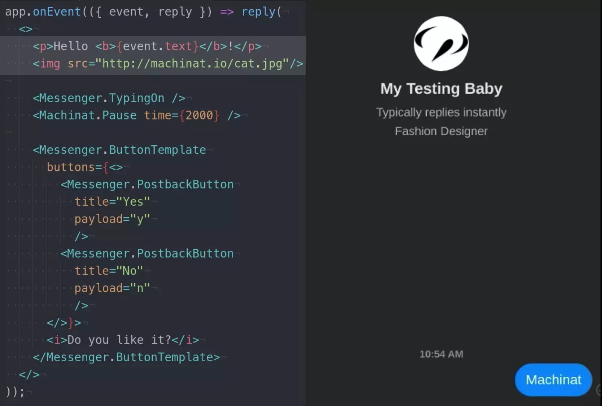
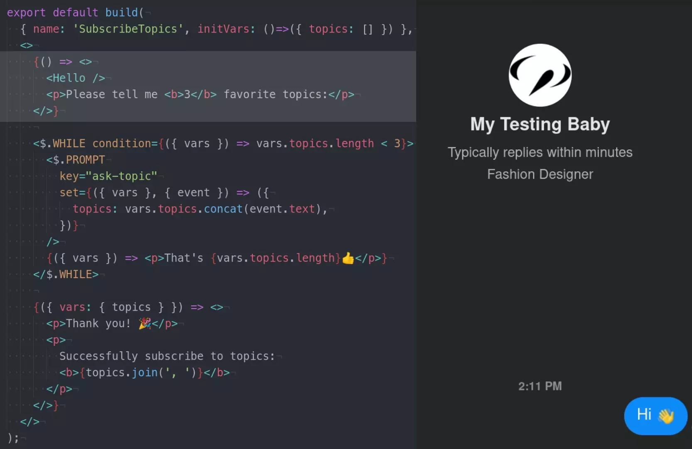
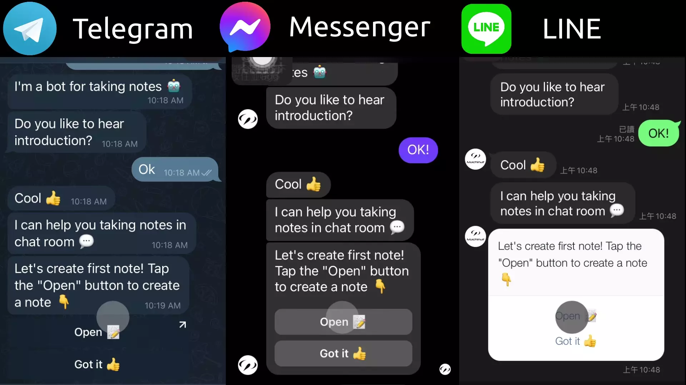

<h1 align="center">
  
  <br/>
</h1>

## The Next-Gen Apps

Machinat is a JavaScript framework for building conversational apps.
These cross-platform, programmatic, intelligent apps provide services in the social network. They are the NPCs in the real life, virtual world and even Metaverse.

## Highlights

<details>
  <summary>Make <i>one app</i> for <i>all platforms</i>.</summary>
</details>

<details>
  <summary><i>100%</i> programming solution. Say goodbye to no-code tools.</summary>
</details>

<details>
  <summary>Build dynamic chat UI in <b>JSX</b>. <i>(demo ▾)</i></summary>
  
</details>

<details>
  <summary>Reuse chat UI logic with <b>Components</b>. <i>(demo ▾)</i></summary>
  
</details>

<details>
  <summary>Program chat flows in <b>Dialog Script</b>. <i>(demo ▾)</i></summary>
  
</details>

<details>
  <summary>Reuse chat flows to make complex conversations. <i>(demo ▾)</i></summary>
  
</details>

<details>
  <summary>Optimize UI/UX for every platform. <i>(demo ▾)</i></summary>
  
</details>

<details>
  <summary>Extend an embeded <b>webview</b> in the chat. <i>(demo ▾)</i></summary>
  
</details>

<details>
  <summary>Init app in <b>1</b> command. Start development in <b>1</b> minute. <i>(demo ▾)</i></summary>
  
</details>

<details>
  <summary>Access chat/user/global state data with ease.</summary>
</details>

<details>
  <summary>Elegant <i>dependency injection</i> system.</summary>
</details>

<details>
  <summary>Maintain intents recognition data in the project.</summary>
</details>

<details>
  <summary>Control workflow with <i>reactive-programming</i> style streams.</summary>
</details>

<details>
  <summary><i>Progressive</i> and <i>extensible</i> framework design.</summary>
</details>

## Get Started

Follow our [tutorial](https://machinat.com/docs/learn/)
to create your first conversational app.

## Install

Initiate an project with the command:

```bash
npm init @machinat/app@latest -- -p <platform> [-p ...] my-project
```

Or using yarn:

```bash
yarn create @machinat/app -- -p <platform> [-p ...] my-project
```

> Supported platforms: `messenger`, `telegram`, `line` and `webview`

## Documents

- [**Document**](https://machinat.com/docs/) - the usage guides.
- [**Tutorial**](https://machinat.com/docs/learn/) - a course to build an app step by step.
- [**API Reference**](https://machinat.com/api/) - API details of the packages.

## Platforms

For now we suppot 3 chat platforms: [Messenger](https://www.messenger.com/), [Telegram](https://telegram.org/) and [LINE](https://line.me/).
In the future, we'll cover all the messaging platforms, including SMS, e-mail, WhatsApp, Twitter, Instagram, Slack, Discord and even voice assistants.

## Examples

Here are some simple but production-ready examples:

- [Note Example](https://github.com/machinat/note-example) - taking note in chat.
- [Todo Example](https://github.com/machinat/todo-example) - managing todos in chat.
- [Pomodoro Eample](https://github.com/machinat/pomodoro-example) - a pomodoro timer in chat.
- [4digits Example](https://github.com/machinat/4digits-example) - playing guessing 4 digits game in chat.

## Comparation

|   | Machinat | Dialogflow | BotFramework | Botpress | Rasa |
|---|---|---|---|---|---|
| Open-Sourced | ✓ |   |   | ✓ | ✓ |
| Cross-Platform | ✓ | ✓ | ✓ | ✓ | ✓ |
| Use All Features<br/>from Platforms | ✓ |   |   |   |   |
| Use Rich Chat UI | ✓ |   | ✓ | ✓ |   |
| Dynamic UI<br/>in Codes | ✓ |   | ✓ |   |   |
| Modulizable UI | ✓ |   |   |   |   |
| Intent Recognition | ✓ | ✓ | ✓ | ✓ | ✓ |
| Choose Recognition<br/>Provider | ✓ |   |   | ✓ |   |
| Conversation Flows | ✓ | ✓ | ✓ | ✓ | ✓ |
| Dynamic Flows<br/>in Codes | ✓ |   | ✓ |   |   |
| Use State | ✓ |   | ✓ | ✓ |   |
| Webview | ✓ |   |   |   |   |
| Extensibility | ✓ |   |   | ✓ |   |
| Fully Control<br/>the Deployment | ✓ |   |   | ✓ | ✓ |

## License

MIT
