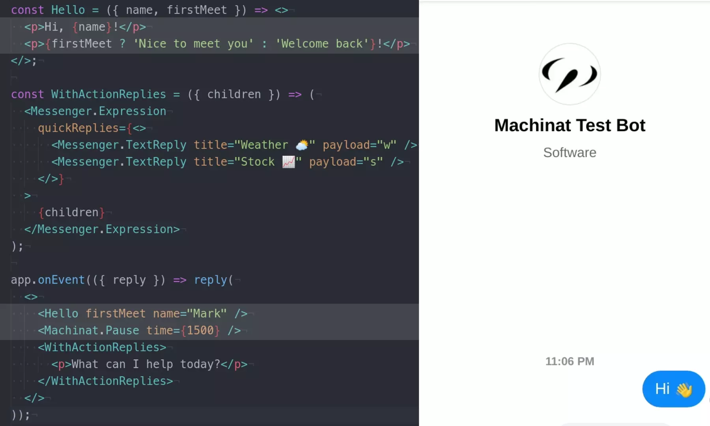
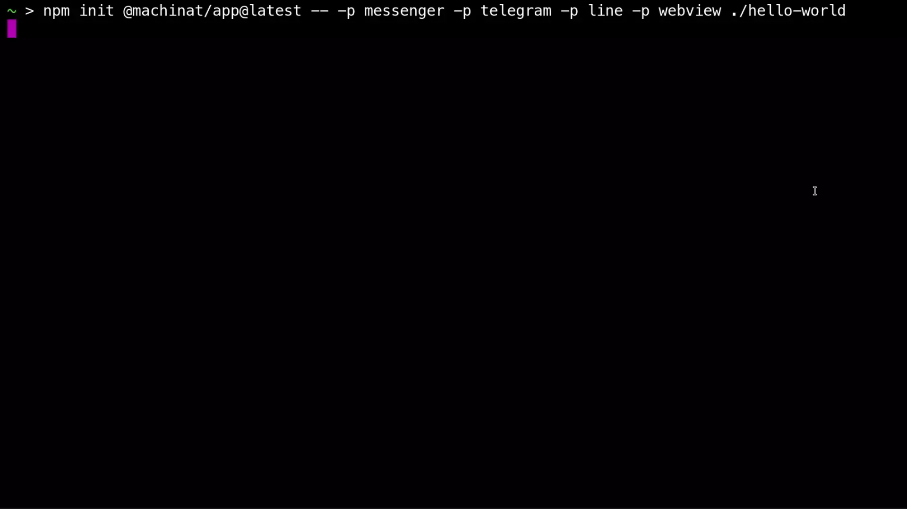

<h1 align="center">
  
  <br/>
</h1>

<div align="center">
  <a href="#platforms">
    
  </a>
  <a href="https://machinat.testspace.com/projects/66804/spaces">
    
  </a>
  <a href="https://www.npmjs.com/package/@machinat">
    
  </a>
  <a href="https://github.com/machinat/machinat/blob/master/LICENSE">
    
  </a>
  <a href="https://twitter.com/machinatjs">
    
  </a>
</div>
<br />

Machint.js builds _cross-platform, feature-rich and intelligent **sociable apps**_.

## The _Sociable App_

Today we reach almost everything through many social platforms. Machinat integrate all the platforms together as _**a new app platform**_. That's the _**Sociable App**_.

- Sociable apps can do more and better than static Chatbots. They provide _functional and dynamic features on all the social platforms_.

- Sociable apps help developers to ship features _more closely to the users_. They help businesses to ship _programmatic marketing and services in the social network_.

- Sociable apps run on wherever the users are. They are _the **next-gen apps** in the social media age_.

## Highlights

<details>
  <summary>Make <i>one app</i> for <i>all platforms</i>.</summary>
</details>

<details>
  <summary><i>100%</i> open-sourced solution in programming.</summary>
</details>

<details>
  <summary>Extend an embedded <b>webview</b> in chat. <i>(demo ▾)</i></summary>
  
</details>

<details>
  <summary>Declarative chat UI in <b>JSX</b>. <i>(demo ▾)</i></summary>
  
</details>

<details>
  <summary>Reuse chat UI with <b>Components</b>. <i>(demo ▾)</i></summary>
  
</details>

<details>
  <summary>Program chat flows in <b>Dialog Script</b>. <i>(demo ▾)</i></summary>
  
</details>

<details>
  <summary>Reuse chat flows to build complicated dialogs. <i>(demo ▾)</i></summary>
  
</details>

<details>
  <summary>Optimize UI/UX for every platform. <i>(demo ▾)</i></summary>
  
</details>

<details>
  <summary>Init app in <b>1</b> command. Start developing in <b>1</b> minute. <i>(demo ▾)</i></summary>
  
</details>

<details>
  <summary>Access chat/user/global state with ease.</summary>
</details>

<details>
  <summary>Elegant <i>DI</i> system.</summary>
</details>

<details>
  <summary>Use any <i>intent recognition</i> service.</summary>
</details>

<details>
  <summary><i>Reactive programming</i> styled workflow.</summary>
</details>

<details>
  <summary><i>Progressive</i> and <i>extensible</i> framework design.</summary>
</details>

## Platforms

Machinat is designed to support ALL the social platforms. Here's the covering status:

##### Currently supported:
<div>
  <a href="https://twitter.com">
    
  </a>
  <a href="https://messenger.com">
    
  </a>
  <a href="https://telegram.org">
    
  </a>
  <a href="https://line.me">
    
  </a>
</div>
<br/>

##### Scheduled in road map:
<div>
  <a href="https://instagram.com">
    
  </a>
  <a href="https://whatsapp.com">
    
  </a>
  <a href="https://facebook.com">
    
  </a>
  <a href="https://discord.com">
    
  </a>
  <a href="https://slack.com">
    
  </a>
  <a href="https://reddit.com">
    
  </a>
  
  
  
</div>

## Get Started

Follow our [tutorial](https://machinat.com/docs/learn/)
to make your first in-chat app.

## Install

Create an app project with the command:

```bash
npm init @machinat/app@latest -- -p <platform> [-p ...] [--webview] my-project
```

Or using yarn:

```bash
yarn create @machinat/app -- -p <platform> [-p ...] [--webview] my-project
```

> Supported platforms: `messenger`, `twitter`, `telegram`, `line`

## Documents

- [**Document**](https://machinat.com/docs/) - the usage guides by topics.
- [**Tutorial**](https://machinat.com/docs/learn/) - a course to build an app step by step.
- [**API Reference**](https://machinat.com/api/) - detailed framework API.

## Examples

Here are some simple but production-ready sample apps:

- [Note Example](https://github.com/machinat/note-example) - taking notes in chat.
- [Todo Example](https://github.com/machinat/todo-example) - managing todos in chat.
- [Pomodoro Example](https://github.com/machinat/pomodoro-example) - a pomodoro timer in chat.
- [4digits Example](https://github.com/machinat/4digits-example) - playing guessing 4 digits game in chat.

## Comparison

|   | Machinat | Dialogflow | BotFramework | Botpress | Rasa |
|---|---|---|---|---|---|
| Open-sourced | ✓ |   |   | ✓ | ✓ |
| Cross-platform | ✓ | ✓ | ✓ | ✓ | ✓ |
| Use all features<br/>from platforms | ✓ |   |   |   |   |
| Use rich chat UI | ✓ |   | ✓ | ✓ |   |
| Dynamic UI<br/>in Codes | ✓ |   | ✓ |   |   |
| Modulizable UI | ✓ |   |   |   |   |
| Intent recognition | ✓ | ✓ | ✓ | ✓ | ✓ |
| Choose recognition<br/>provider | ✓ |   |   | ✓ |   |
| Conversation flows | ✓ | ✓ | ✓ | ✓ | ✓ |
| Dynamic flows<br/>in codes | ✓ |   | ✓ |   |   |
| Use state | ✓ |   | ✓ | ✓ |   |
| Webview | ✓ |   |   |   |   |
| Extensibility | ✓ |   |   | ✓ |   |
| Fully controlled<br/>deployment | ✓ |   |   | ✓ | ✓ |

> [Let us know](https://github.com/machinat/machinat/issues/new)
> if there is any mistake in the comparison chart.
