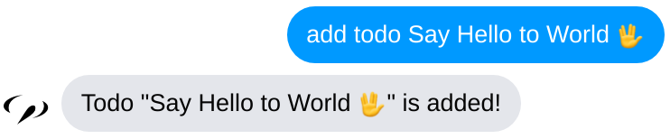
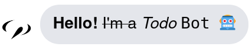
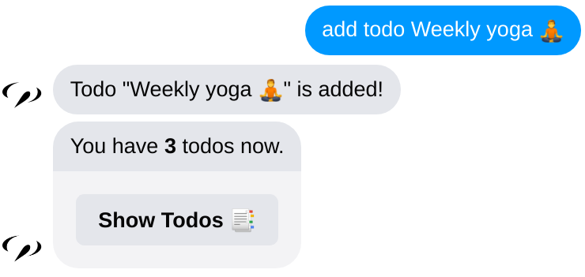
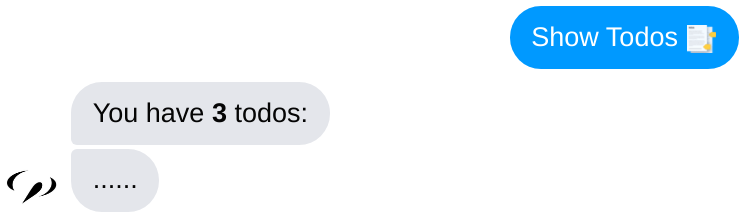

Receive a message and send the answer back is the most basic function of
chatbots. In this lesson you will learn how to receive specific type of event
and make the response accordingly.

>　Time to accomplish: 10 minutes

## Listen to Event

### Handle Text Message

Text messages are the most common message type your bot would meet. Let's enable
your bot to handle an `"add todo <todo name>"` command.

Edit the `src/handlers/handleMessage.ts` handler function like this:

```tsx {8-15} title="src/handlers/handleMessage.tsx"
import Machinat from '@machinat/core';
import { ChatEventContext } from '../types';

const handleMessage = async ({
  event,
  reply,
}: ChatEventContext & { event: { category: 'message' } }) => {
  if (event.type === 'text') {
    const matchingAddTodo = event.text.match(/add(\s+todo)?(.*)/i);

    if (matchingAddTodo) {
      const todoName = matchingAddTodo[2].trim();
      return reply(<p>Todo "<b>{todoName}</b>" is added!</p>);
    }
  }

  await reply(<p>Hello! I'm a Todo Bot 🤖</p>);
};

export default handleMessage;
```

Now your bot can accept `add todo <name>` command like this:




### `event` Object

The `handleMessage` handler receive a event context object when user sends a
message to your bot. You can get the event infomations from the `event` property.
Here are the common infos in `event`:

```ts
{
  platform: 'messenger',  // chat platform
  category: 'message',    // event category
  type: 'text',           // event type
  payload: {/*...*/},     // raw data from chat platform
  user: {/*...*/},        // user object
  channel: {/*...*/},     // chatroom object
}
```

You can use the `platform`, `category` and `type` combination to identify
kinds of events. All message event with `'text'` type implement the `event.text`
interface. So we can extract the todo name with regular expression safely.

```ts
if (event.type === 'text') {
  event.text; // string
}
```

## Reply Message

The `reply` function from the context sends messages back to the chatroom. The
easiest way to use it is replying a string like:

```tsx
await reply('hello world');
```

### JSX Syntax

The html alike syntax `<p>Todo "<b>{todoName}</b>" is added!</p>` is called
**JSX**. `<p>...</p>` element represent a message bubble containing the inner
text children.

Despite plain text, the children can contain other elements like `<b>...</b>`.
An expression can also be inserted with the `{todoName}` syntax.


### Formatting Text

Notice that `<b>{todoName}</b>` element makes the todo name bold as the way it is in
html. Try change the tag to `i`, `s` and `code` and see what's different. These
tags are **textual** and work like plain text so they can be placed in
`<p></p>` element.

> 
>
> `<b>Hello!</b> <s>I'm a</s> <i>Todo</i> <code>Bot 🤖</code>` in desktop **Messenger**.


:::info
The effect of formatting text is different depends on chat platform:
- **Messenger** only support formatting in the desktop browser. It shows markdown
  syntax in mobile app.
- **LINE** doesn't support formatting and shows plain text only.
:::

### General UI

The element with uncaptalized tags like `p` and `b` are general tags supported
on all the chat platforms. It is the easiest way to send a message across
different platforms.

### Grouping Messages

Now let's add more details after adding on todo:

```tsx {7-12} title="src/handlers/handleMessage.tsx"
// ...
  if (event.type === 'text') {
    const matchingAddTodo = event.text.match(/add(\s+todo)?(.*)/i);

    if (matchingAddTodo) {
      const todoName = matchingAddTodo[2].trim();
      return reply(
        <>
          <p>Todo "<b>{todoName}</b>" is added!</p>
          <p>You have <b>{3}</b> todos now.</p>
        </>
      );
    }
  }
  // ...
```

The element `<></>` with empty tag is called _Fragment_. You can use it to group
serveral messages together and send them once. The result would look like:


With _Fragment_, sending messages is more like sketching up a view to user. You
can focus on making UI/UX, and _Machinat_ would take the rest of jobs.

### Native UI

Desite the general tags, each chat platform may have their own special features.
These features are available as **Native Component** of each platform.

Let's try adding a button for showing all todos. Follow the guide of the
platform you choose to edit `handleMessage`:


import Tabs from '@theme/Tabs';
import TabItem from '@theme/TabItem';

<Tabs
  groupId="chat-platforms"
  defaultValue="messenger"
  values={[
    {label: 'Messenger', value: 'messenger'},
    {label: 'Telegram', value: 'telegram'},
    {label: 'LINE', value: 'line'},
  ]}>
  <TabItem value="messenger">


```tsx {2,17-26} title="src/handlers/handleMessage.tsx"
import Machinat from '@machinat/core';
import * as Messenger from '@machinat/messenger/components';
import { ChatEventContext } from '../types';

const handleMessage = async ({
  event,
  reply,
}: ChatEventContext & { event: { category: 'message' } } ) => {
  if (event.type === 'text') {
    const matchingAddTodo = event.text.match(/add(\s+todo)?(.*)/i);

    if (matchingAddTodo) {
      const todoName = matchingAddTodo[2].trim();
      return reply(
        <>
          <p>Todo "<b>{todoName}</b>" is added!</p>
          <Messenger.ButtonTemplate
            buttons={
              <Messenger.PostbackButton
                title="Show Todos 📑"
                payload={JSON.stringify({ type: 'list' })}
              />
            }
          >
            You have <b>{3}</b> todos now.
          </Messenger.ButtonTemplate>
        </>
      );
    }
  }
  // ...
```

> - `Messenger.ButtonTemplate` sends a text message with buttons.
> - `Messenger.PostbackButton` add a button to post `payload` back.

  </TabItem>
  <TabItem value="telegram">


```tsx {2,17-28} title="src/handlers/handleMessage.tsx"
import Machinat from '@machinat/core';
import * as Telegram from '@machinat/telegram/components';
import { ChatEventContext } from '../types';

const handleMessage = async ({
  event,
  reply,
}: ChatEventContext & { event: { category: 'message' } } ) => {
  if (event.type === 'text') {
    const matchingAddTodo = event.text.match(/add(\s+todo)?(.*)/i);

    if (matchingAddTodo) {
      const todoName = matchingAddTodo[2].trim();
      return reply(
        <>
          <p>Todo "<b>{todoName}</b>" is added!</p>
          <Telegram.Text
            replyMarkup={
              <Telegram.InlineKeyboard>
                <Telegram.CallbackButton
                  text="Show Todos 📑"
                  data={JSON.stringify({ type: 'list' })}
                />
              </Telegram.InlineKeyboard>
            }
          >
            You have <b>{3}</b> todos now.
          </Telegram.Text>
        </>
      );
    }
  }
  // ...
```

> - `Telegram.Text` sends a text message bubble with telegram message options.
> - `Telegram.InlineKeyboard` attach buttons in children below a message.
> - `Telegram.CallbackButton` add a button to post `data` back.

  </TabItem>
  <TabItem value="line">


```tsx {2,17-27} title="src/handlers/handleMessage.tsx"
import Machinat from '@machinat/core';
import * as Line from '@machinat/line/components';
import { ChatEventContext } from '../types';

const handleMessage = async ({
  event,
  reply,
}: ChatEventContext & { event: { category: 'message' } } ) => {
  if (event.type === 'text') {
    const matchingAddTodo = event.text.match(/add(\s+todo)?(.*)/i);

    if (matchingAddTodo) {
      const todoName = matchingAddTodo[2].trim();
      return reply(
        <>
          <p>Todo "<b>{todoName}</b>" is added!</p>
          <Line.ButtonTemplate
            altText="You have 3 todos now."
            actions={
              <Line.PostbackAction
                label="Show Todos 📑"
                data={JSON.stringify({ type: 'list' })}
              />
            }
          >
            You have <b>{3}</b> todos now.
          </Line.ButtonTemplate>
        </>
      );
    }
  }
  // ...
```

> - `Line.ButtonTemplate` sends a text message bubble with buttons.
> - `Line.PostbackAction` add a button to post `data` back.


  </TabItem>
</Tabs>

The tag like `Messenger.ButtonTemplate` is a **Native Component** of chat platform.
These components represent platform specific features, and can only be sent to the
platform they belongs to.

If you are building a cross-platform app, send the message according to platform
like:

```tsx {1,6-14} title="src/handlers/handleMessage.tsx"
const handleMessage = async ({
  platform,
  event,
  reply,
}: ChatEventContext & { event: { category: 'message' } } ) => {
  // ...
    return reply(
      <>
        <p>Todo "<b>{todoName}</b>" is added!</p>
        {
          platform === 'messenger' ? (
            // messenger component...
          ) : platform === 'telegram' ? (
            // telegram component...
          ) : (
            <p>You have <b>{3}</b> todos now.</p>
          )
        }
      </>
    );
```

Now a button should be attached to the reply of bot like:




### Props

The attributes we put on the **JSX** element are **Props**:

```tsx {2,4-5}
    <Messenger.ButtonTemplate
      buttons={
        <Messenger.PostbackButton
          title="Show Todos 📑"
          payload={JSON.stringify({ type: 'list' })}
        />
      }
    >
      You have <b>{3}</b> todos now.
    </Messenger.ButtonTemplate>
```

Like _React.js_, they are used to pass values to the component. The value can be
text (like `title`), expression (like `payload`) or even another element (like
`buttons`).

We pass JSON encoded data on `payload` (or `data`) prop to indicate the action
type. We can use the data later to handle the postback event.


## Event Flow

### Handle Postback Event

The button we added would post data back to our server while user tap the button
in the chatroom. We can handle the postback events by adding these codes:


<Tabs
  groupId="chat-platforms"
  defaultValue="messenger"
  values={[
    {label: 'Messenger', value: 'messenger'},
    {label: 'Telegram', value: 'telegram'},
    {label: 'LINE', value: 'line'},
  ]}>
  <TabItem value="messenger">


Create a new `src/handlers/handlePostback.tsx` file:

```tsx  title="src/handlers/handlePostback.tsx"
import Machinat from '@machinat/core';
import { ChatEventContext } from '../types';

const handlePostback = async ({
  event,
  reply,
}: ChatEventContext & { event: { type: 'postback' } } ) => {
  const action = JSON.parse(event.data);

  if (action.type === 'list') {
    return reply(
      <>
        <p>You have <b>3</b> todos:</p>
        <p>......</p>
      </>
    );
  }
};

export default handlePostback;
```

And add these codes in `src/main.tsx`:

```tsx title="src/main.tsx"
import handlePostback from './handlers/handlePostback';
// ...
const main = (event$: Stream<AppEventContext>): void => {
  // ...
  event$
    .pipe(
      filter(
        (ctx): ctx is ChatEventContext & { event: { type: 'postback' } } =>
          ctx.event.type === 'postback'
      )
    )
    .subscribe(handlePostback);
  // ...
```


  </TabItem>
  <TabItem value="telegram">


Create a new `src/handlers/handlePostback.tsx` file:

```tsx  title="src/handlers/handlePostback.tsx"
import Machinat from '@machinat/core';
import { AnswerCallbackQuery } from '@machinat/telegram/components';
import { ChatEventContext } from '../types';

const handlePostback = async ({
  event,
  reply,
}: ChatEventContext & { event: { type: 'callback_query' } } ) => {
  const action = JSON.parse(event.data);
  const answerQuery = <AnswerCallbackQuery queryId={event.queryId} />;

  if (action.type === 'list') {
    return reply(
      <>
        {answerQuery}
        <p>You have <b>3</b> todos:</p>
        <p>......</p>
      </>
    );
  }

  return reply(answerQuery);
};

export default handlePostback;
```

:::info
The `callback_query` event of Telegram need to be replied with
`AnswerCallbackQuery` to stop the client side pending.
:::

And add these codes in `src/main.tsx`:

```tsx title="src/main.tsx"
import handlePostback from './handlers/handlePostback';
// ...
const main = (event$: Stream<AppEventContext>): void => {
  // ...
  event$
    .pipe(
      filter(
        (ctx): ctx is ChatEventContext & {
          event: { type: 'callback_query' };
        } => ctx.event.type === 'callback_query'
      )
    )
    .subscribe(handlePostback);
  // ...
```


  </TabItem>
  <TabItem value="line">


Create a new `src/handlers/handlePostback.tsx` file:

```tsx  title="src/handlers/handlePostback.tsx"
import Machinat from '@machinat/core';
import { ChatEventContext } from '../types';

const handlePostback = async ({
  event,
  reply,
}: ChatEventContext & { event: { type: 'callback_query' } } ) => {
  const action = JSON.parse(event.data!);

  if (action.type === 'list') {
    return reply(
      <>
        <p>You have <b>3</b> todos:</p>
        <p>......</p>
      </>
    );
  }
};

export default handlePostback;
```

And add these codes in `main`:

```tsx title="src/main.tsx"
import handlePostback from './handlers/handlePostback';
// ...
const main = (event$: Stream<AppEventContext>): void => {
  // ...
  event$
    .pipe(
      filter(
        (ctx): ctx is ChatEventContext & { event: { type: 'postback' } } =>
          ctx.event.type === 'postback'
      )
    )
    .subscribe(handlePostback);
  // ...
```


  </TabItem>
</Tabs>


Try tap the `Show Todos 📑` button in the chat room and you should see:



### Stream in `main`

In the `main` function, the `event$` argument is a **stream** of all events. You
can `.subscribe()` the stream to listen events, or `.pipe()` it to create a new
stream.

We use the `filter(...)` operator to allow only the postback events to pass. The
filtered stream is then handled by the `handlePostback` handler.

```ts
event$
  .pipe(
    filter((ctx) => {
      //
      return ctx.event.type === 'postback'
    })
  )
  .subscribe(({ event }) => {

  });
```

---

Our bot can receive events from user and reply simple answer. Next, we'll learn
how to make more complex UI for more powerful features.
